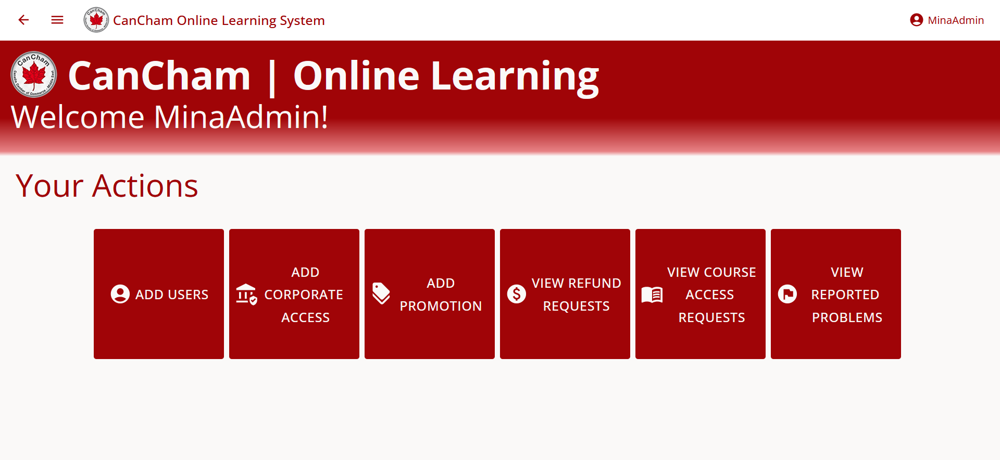

# CanCham Online Learning System

## Badges
 
 
 


## Table of Contents

- [Descrption](#descrption)
- [Features](#features)
- [Getting Started](#getting_started)
- [Tech](#tech)
- [APIs](#apis)
- [Screenshots](#screenshots)
- [Credits](#credits)

## Description
This is an online platform ,for the Canadian Chamber of Commerce in the Middle East, for Individual students and Corporate trainees to enroll to new courses, solve the tests and earn a certificate for each completed course. In addition, it is a workspace for instructors to upload a tutoring video, some test questions and get an income from students registering to his courses.
This project followed the Agile Methodology and was split into 3 Sprints

## Features

##### As a guest you could:
- View All available courses
- Register to be an Indiviual Student

##### As an Individual Student you could:
- View all available courses
- View Popular Courses
- View Details of a specific course
- Register to a specific course
- View instructor Ratings
- View Wallet in the profile
- Get discounts for a limited time
- View your profile
- Update profile
- Report a problem and follow up on it
- Rate a course
- Rate an instructor
- Pay the course by a credit card

##### As a Corporate Trainee you could:
- do the same as an Individual trainee except your are registered to a course by the admin

##### As an Instructor you could:
- View your courses
- View all available courses
- Create a new course
- Delete a course
- Publish Course
- Close a published course
- View Course Ratings
- Add a discount to the course for a limited time
- View your profile
- Update profile
- View your Ratings
- View your Contract
- View your Invoices
- Report a problem and follow up on it

##### As an Admin you could:
- View your profile
- Update profile
- Add new users of type: Admin, Instructor, Corporate Trainee
- Accept/Reject Refund Requests
- View Course Access Requests
- Grant Course Access 
- Add a discount to a course for a limited time
- View Reported Problems with full details
- *Add multiple users at once via .csv file upload*

## Getting Started
- Open the terminal in Visual Studio Code
- Install packages by running 
```bash
> npm i
> cd backApp && npm i
> cd ..
> cd front-app && npm i
```
- Run the website using 
```bash
> npm run dev
```
- The client will open in localhost port 3000 and the server on port 8000

## Tech

Our Web application uses a number of open source projects to work properly:

- [ReactJS] - HTML enhanced for web apps!
- [MongoDB] - Online Database shared among group
- [MUI] - great UI boilerplate for modern web apps
- [node.js] - evented I/O for the backend
- [Express] - fast node.js network app framework 

## APIs Used

Our website makes use of a couple APIs to handle data processing and display

- [ExchangeRate API](https://www.exchangerate-api.com/) To fetch the latest currency exchange rates
- [StripAPI](https://stripe.com/docs/api) To process payments via Card payment and other methods
- [YouTube API](https://developers.google.com/youtube/iframe_api_reference) To display, play and track YouTube video

## Credits
- Mina Ehab 49-1644
- Antony Mina 49-2960
- Jack Amir 49-2421
- Salma Ahmed 49-1657
- John Nabil 49-0694

## ScreenShots
##### Admin




##### Individual Trainee


##### Instructor


